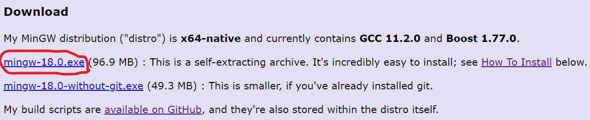

# Dark forest
Survive for as long as you can

# Set up
## Install MinGW (if it hasn't been installed)
- download exe file here [MingGW Distro](https://nuwen.net/mingw.html)

- lauch the file to extract (copy the path of extracted folder)
- go to Control Panel -> System -> Advanced System Setting -> Environment Variable -> Edit path from System variable -> new -> paste the path and save everything

## Set path for library
- extract all zip files in prerequisite folder and put extracted files somewhere else
- do these steps to all extracted libraries:
  + copy the path "library_name/lib/x64"
  + go to Control Panel -> System -> Advanced System Setting -> Environment Variable -> Edit path from System variable -> new -> paste the path
  + or you can do this: 
  + 
- save everything
## Run the exe file in "dark forest" folder and enjoy the game!

# Screenshot
## menu

## setting

## game play

## scoreboard

